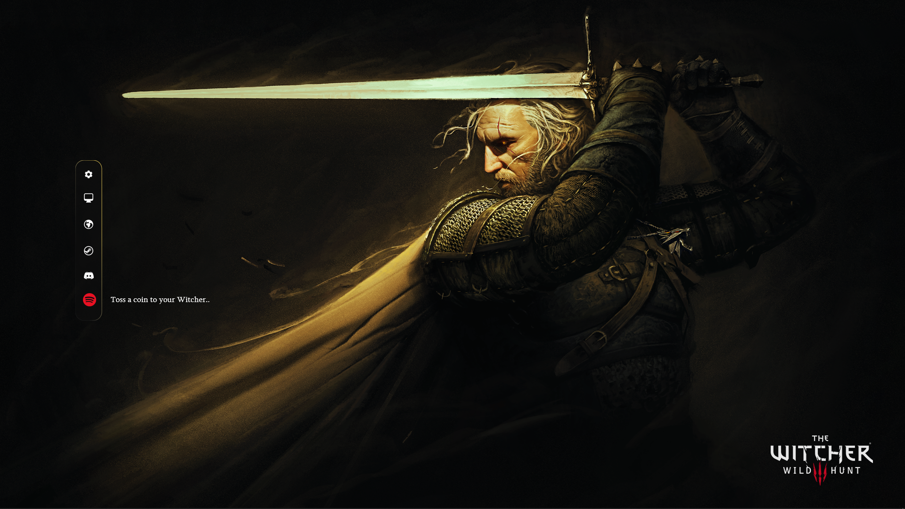

# SideBarLauncher - Witcher Edition

A minimal sidebar launcher for **Rainmeter**, inspired by **The Witcher 3** and created for the game's 7th Anniversary artwork.

This was the **first Rainmeter skin I published**, combining a clean desktop launcher with a Witcher-themed design.

> Originally released on DeviantArt in 2022.

---

## Preview

> Add one or more screenshots here.

<!-- Example -->
<!--  -->

---

## Features

- Minimal vertical sidebar launcher
- Six quick-launch icons
- Witcher-inspired descriptions for each application
- Easily customizable color scheme
- Lightweight and easy to modify

### Default launcher buttons

- Control Panel
- This PC
- Google Chrome
- Steam
- Discord
- Spotify

---

## Installation

1. Install the latest version of **Rainmeter**.
2. Download or clone this repository.
3. Copy the skin folder into:

```
Documents\Rainmeter\Skins\
```

4. Refresh Rainmeter and load the skin.

---

## Customization

### Colors

Colors can be changed in the variables file without modifying the main skin.

### Application paths

The launcher assumes applications are installed in their default locations.

If an application does not launch correctly:

- edit the corresponding `.ini` file
- modify the `LeftMouseDownAction` value
- or point it to your own shortcut

Helpful comments are included throughout the configuration files.

---

## Included artwork

This repository includes the **The Witcher 3 – 7th Anniversary** wallpaper.

### Credits

- **CD PROJEKT RED** – The Witcher franchise
- **Daniel Valaisis** – Illustration

Official sources:

- https://www.cdprojektred.com/
- https://www.thewitcher.com/

If requested by the copyright holders, the artwork will be removed from this repository.

---

## Version

**Current version:** 1.01

No additional features are currently planned, although bug fixes or community-requested improvements may be considered.

---

## Original release

Originally published on DeviantArt:

https://www.deviantart.com/ltszatyi/art/SideBarLauncher-Minimal-1-01-Witcher-edition-941768871

---

## License

The original release was published under:

**Creative Commons Attribution-NonCommercial-NoDerivatives 3.0 (CC BY-NC-ND 3.0)**

See the LICENSE file for details.
